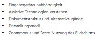

# Grundlagen der Programmierung: Barrierefreie Software

Dies ist das Repository für den **LinkedIn Learning** Kurs `Grundlagen der Programmierung: Barrierefreie Software`. Den gesamten Kurs finden Sie auf [LinkedIn Learning][lil-course-url].

![COURSENAME][lil-thumbnail-url] 

# Barrierefrei entwickeln

* [The WebAIM Million](https://webaim.org/projects/million/)

## Was bedeutet Barrierefreiheit?

## Warum ist Barrierefreiheit für Entwickler wichtig?

## Barrierefreiheit verstehen

* Eingabegeräteunabhängigkeit
* Assistive Technologien verstehen
* Dokumentstruktur und Alternativzugänge
* Darstellungsmodi
* Zoommodus und Beste Nutzung des Bildschirms

## Teststrategien für Entwickler

* Browserentwicklerwerkzeuge
* Browsererweiterungen
* Programmierumgebungserweiterungen

## Barrierefrei Entwickeln

* Nutzen der Platform
* Barrieren vermeiden
* Alternativzugänge erlauben
* Event Handling unabhängig von Eingabegeräten
* Darstellungsmodi in CSS

## Beispiele

* Die [fehlerhafte seite](fehlerhafte-seite.html) zeigt Probleme auf, die wir vermeiden wollen.
* In der [Lösungsseite](lösung.html) sind diese Probleme behoben.
* [Mehr Inhalte laden](mehr-inhalte.html)

## Im Kurs verwendete Webseiten und Produkte

* [Visual Studio Code](https://code.visualstudio.com)
* [Microsoft Edge Developer Tools](https://docs.microsoft.com/microsoft-edge/devtools-guide-chromium/)
* [Accessibilty Insights](https://accessibility-insights.io)
* [Webhint](https://webhint.io): [NPM package](https://www.npmjs.com/package/hint), [VS Code extension](https://aka.ms/devtools-for-code).

### Autor

**Christian Heilmann**

_Web- und Browserentwickler_

Sehen Sie sich andere Kurse des Autors auf [LinkedIn Learning](https://www.linkedin.com/learning/instructors/christian-heilmann) an.

[0]: # (Replace these placeholder URLs with actual course URLs)
[lil-course-url]: https://www.linkedin.com/learning/grundlagen-der-programmierung-barrierefreie-software
[lil-thumbnail-url]: https://media.licdn.com/dms/image/D4D0DAQFBFYuSNGiS0g/learning-public-crop_675_1200/0/1698215086483?e=2147483647&v=beta&t=c2rOSBijpxt5pEbg_w-q6KMbTOn29vGg4SzQ2mItGnI
